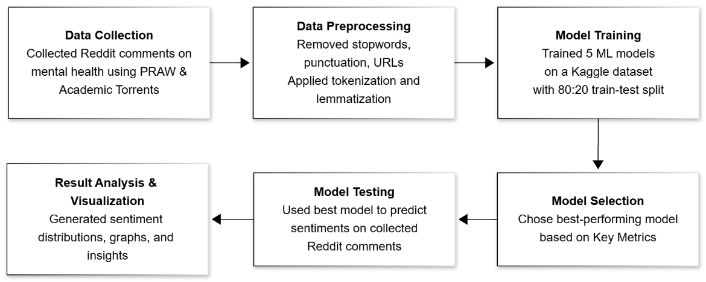

# Sentiment Analysis of Reddit Comments on Mental Health

This project analyzes Reddit discussions related to mental health using Natural Language Processing (NLP) and machine learning models. Reddit comments are collected, cleaned, and classified into sentiment categories to understand emotional patterns in online communities.

The project demonstrates a complete NLP pipeline including data collection, preprocessing, model training, evaluation, and sentiment prediction on real Reddit data.

---

## Problem Statement

Mental health discussions on social media platforms contain valuable insights about people's emotions and experiences. However, the large volume of text data makes manual analysis impractical.  

The goal of this project is to automatically classify Reddit comments into sentiment categories using machine learning techniques and analyze patterns in mental health related conversations.

---

## Project Workflow

The project follows a structured NLP pipeline from data collection to sentiment prediction.



---

## Machine Learning Models Used

Multiple machine learning models were implemented and compared to evaluate their performance on the sentiment dataset.

- Logistic Regression
- Naive Bayes
- Random Forest
- Support Vector Machine (SVM)
- VADER (baseline rule-based sentiment analyzer)

The models were evaluated using common classification metrics such as:

- Accuracy
- Precision
- Recall
- F1-Score
- Confusion Matrix
- ROC-AUC (where applicable)

Logistic Regression produced the most stable performance and was selected as the final model for predicting sentiments on Reddit comments.

---

## Data Collection

Reddit comment data was collected using:

- **PRAW (Python Reddit API Wrapper)** for extracting Reddit posts and comments
- **Academic Torrents Reddit dataset** for accessing large historical Reddit data dumps

Keywords such as **mental health**, **anxiety**, and **depression** were used to filter relevant discussions.

The raw dataset contained millions of Reddit comments. For this repository, smaller **sample datasets** are included so the code can be executed easily.

---

## Data Preprocessing

Raw Reddit text contains noise such as URLs, punctuation, and unnecessary characters. A preprocessing pipeline was applied before training the machine learning models.

Preprocessing steps include:

- Removing URLs and special characters
- Converting text to lowercase
- Removing punctuation and numbers
- Stopword removal
- Tokenization
- Lemmatization

The preprocessing script can be found in:

```
preprocessing/preprocess_reddit.py
```

---

## Final Model & Prediction

After comparing the performance of different models, **Logistic Regression** was selected as the final model.

The trained model and supporting components are stored in:

```
saved_models/
├── logistic_regression.pkl
├── vectorizer.pkl
└── label_encoder.pkl
```


These files allow predictions to be generated without retraining the model.

The inference script used to generate predictions on Reddit comments is located in:

```
inference/saving_linear_regression_model.py
```


Predicted sentiment results are stored in:

```
data/final_predictions.csv
```


---

## Visualization and Analysis

Sentiment distributions and model performance were visualized using Python plotting libraries.

Example outputs include:

- Sentiment distribution graphs
- Confusion matrices
- Model performance comparisons

Example visualizations are included in the `results/` folder.


---

## Tech Stack

Python  
Pandas  
NumPy  
Scikit-learn  
NLTK  
Matplotlib  
Seaborn  
Joblib  

---

## How to Run the Project

### 1. Install dependencies
```
pip install -r requirements.txt
```
### 2. Preprocess Reddit data
```
python preprocessing/preprocess_reddit.py
```
### 3. Train and save the model
```
python inference/saving_linear_regression_model.py
```
### 4. Generate visualizations
```
python evaluation/visualizations.py
```

---

## Repository Structure

```
sentiment-analysis-reddit-mental-health

data/ datasets and predictions
preprocessing/ text cleaning scripts
models/ ML model training scripts
baselines/ VADER sentiment baseline
inference/ final prediction pipeline
evaluation/ visualization scripts
saved_models/ trained model files
samples/ sample prediction outputs
results/ graphs and analysis
```

---

## Future Improvements

- Apply deep learning models such as LSTM or BERT
- Expand dataset using more Reddit communities
- Build a real-time dashboard for monitoring sentiment trends

---

## Author

Shree Ram Jamana
